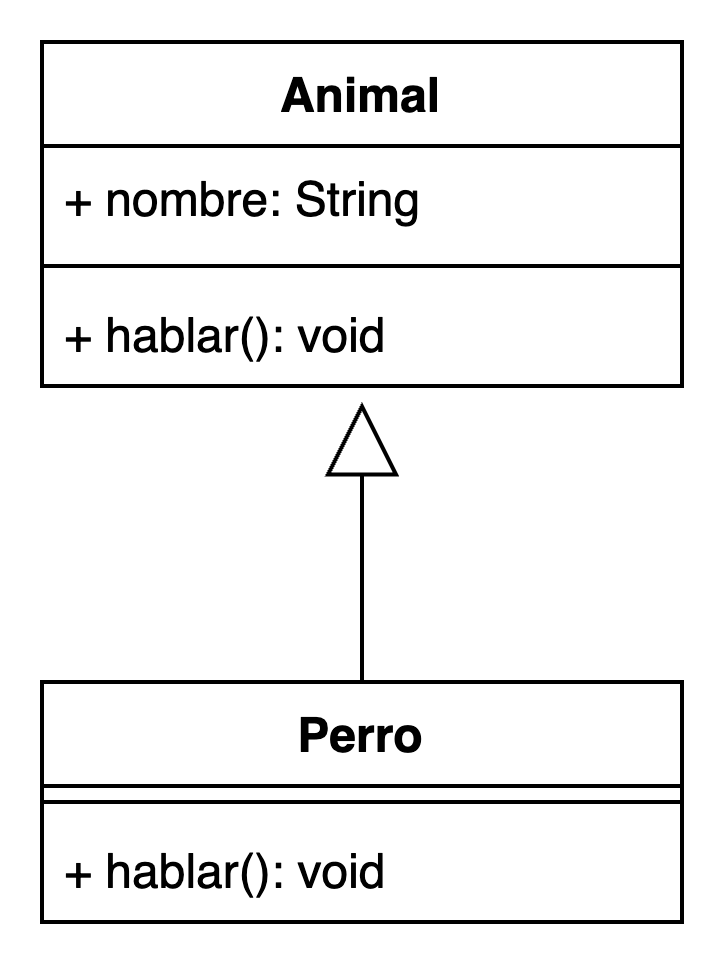

# Clase 6  
## Herencia y Polimorfismo en Java  
### Proyecto, Diseño e Implementación de Sistemas Computacionales  
Profesor: Franco Niz  
7.º Año – Escuela Técnica N.º 1 “Ingeniero Rafael Cantón”

---

## Preguntas de la clase anterior

1. ¿Cuál es la función de un constructor en una clase de Java?
2. ¿Por qué es útil la palabra clave `this` al escribir constructores o métodos?
3. ¿Qué significa "encapsular" los atributos de una clase y cómo se logra?

---

## Objetivos de la clase

- Comprender el concepto de **herencia** en la POO.
- Aplicar la palabra clave `extends` para reutilizar clases.
- Entender y aplicar **polimorfismo** en Java.
- Reconocer jerarquías de clases en UML.
- Desarrollar ejemplos con herencia y métodos sobrescritos.

---

## ¿Qué es la herencia?

La **herencia** permite que una clase herede atributos y métodos de otra.

```java
public class Animal {
    private String nombre;
    
    public void hablar() {
        System.out.println("Hace un sonido");
    }
}

public class Perro extends Animal {
    @Override
    public void hablar() {
        System.out.println("Guau!");
    }
}
```

---

## Jerarquía UML

<p style="text-align: center;">
  
</p>

---

## ¿Qué es el polimorfismo?

> El **polimorfismo** permite que un mismo método se comporte distinto según el objeto que lo usa.

```java
Animal a = new Perro();
a.hablar();  // Imprime: Guau!
```

- El tipo declarado es `Animal`.
- Pero el método ejecutado es el de `Perro`.

---

## Sobrescritura de métodos

Una subclase puede **redefinir** un método de la superclase.

```java
@Override
void hablar() {
    System.out.println("Guau!");
}
```

Es una forma de **especializar el comportamiento**.

---

## Clases y Métodos Abstractos

¿Tiene sentido crear un objeto de tipo `Figura`? ¿Cuál sería su área? A veces, creamos clases que son demasiado genéricas para existir por sí solas. Para eso usamos `abstract`.

- Una **clase abstracta** no se puede instanciar (`new Figura()` dará error).
- Un **método abstracto** no tiene cuerpo y **obliga** a las subclases a implementarlo.

---

### Clases y Métodos Abstractos: Ejemplo

```java
// Clase abstracta: no se pueden crear objetos de tipo "Figura"
public abstract class Figura {
    protected String nombre;

    // Método abstracto: las subclases DEBEN implementarlo
    public abstract double area();

    public void mostrarNombre() {
        System.out.println("Soy una figura: " + nombre);
    }
}

// Subclase concreta
public class Cuadrado extends Figura {
    private double lado;
    public Cuadrado(double lado) { this.lado = lado; this.nombre = "Cuadrado"; }

    @Override
    public double area() {
        return lado * lado;
    }
}
```

---

## Extendiendo, no solo reemplazando: `super`

A menudo, no queremos reemplazar por completo un método, sino **extenderlo**. Para eso usamos la palabra clave `super`, que nos permite llamar a métodos y constructores de la clase padre.

---

### `super` en acción

```java
// Superclase
public class Vehiculo {
    protected int velocidad;
    public Vehiculo() { this.velocidad = 0; }
    public void acelerar() {
        velocidad += 10;
        System.out.println("Vehículo genérico acelerando a " + velocidad + " km/h");
    }
}

// Subclase
public class Coche extends Vehiculo {
    private String marca;
    public Coche(String marca) {
        super(); // Llama al constructor de Vehiculo()
        this.marca = marca;
    }
    @Override
    public void acelerar() {
        super.acelerar(); // Llama al método del padre
        System.out.println("El coche " + marca + " usa su motor para ir más rápido.");
    }
}
```

---

## Actividad práctica

1. Crear una superclase `Figura` con método `area()` y `nombre`.
2. Crear subclases `Cuadrado`, `Círculo` y `Triángulo` que extiendan `Figura`.
3. Cada subclase debe:
   - Tener atributos propios (`lado`, `radio`, `base` y `altura`)
   - Sobrescribir `area()` devolviendo el área correspondiente.
4. En `Main`, crear un arreglo de `Figura[]` y recorrerlo mostrando cada área.

---

## Tarea

- Crear jerarquía `Empleado` → `Gerente`, `Programador`, `Diseñador`
- Todos deben sobrescribir `trabajar()` y `mostrarDatos()`
- Crear array de empleados y recorrerlo invocando métodos polimórficos
- Subir el código a GitHub

---

## ¿Preguntas?
